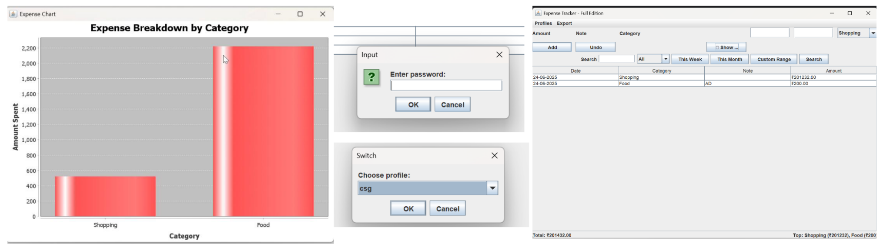

# 📊 Expense-Tracker-Project

A collaborative **Group Expense Tracker Web App** built by a team of four to manage and visualize group expenses efficiently. This Java-based application helps users log shared expenses, calculate balances, and simplify group settlements.


---

## 🛠️ Tech Stack

- **Language:** Java
- **IDE Used:** IntelliJ IDEA
- **Database:** Not Applicable 
---

## ✨ Features

- Add and categorize group expenses
- View total and individual shares
- Balance settlement suggestions
- Simple UI for fast input and editing
- Lightweight Java console-based logic *(or mention GUI if applicable)*

---

## 📄 Documentation

- [📄 Project Report](report%20done.pdf)
- [📊 Presentation Slides](ppt.pdf)

---

## 👥 Team Members

- Nupur Debnath ([@Nupur191204](https://github.com/Nupur191204))  
- Chinmay Gawali  
- Ayaan Quadeer
- Kaushal Raj
---

## 🚀 How to Run

1. Clone this repository:

   ```bash
   git clone https://github.com/Nupur191204/Expense-Tracker-Project.git
